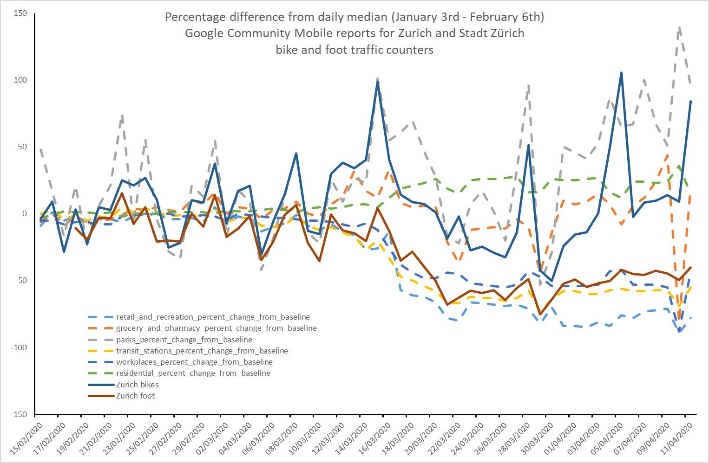

<!-- Scripts to link to the Vega/Vega-Lite runtime -->

# Zurich Active Movement

## Background

During the COVID-19 crisis, information about mobility patterns within cities is an important way of understanding changes in behaviour as a response to public health recommendations and restrictions. Google's [COVID-19 Community Mobility Reports](https://www.google.com/covid19/mobility/) are one source of valuable information. However, the underlying data and detailed methodology are not available. Many cities passively sense flows of pedestrians, cyclists and vehicles, and we were curious as to the extent to which these data reflected changes in behaviour. Since the City of Zurich publishes a range of Open Data with a short temporal lag, we first explored the relationship between these data and Google's COVID-19 Community Mobility Reports. We assumed that the Google data cover the canton, but as is visible in the following figure, the city data are closely related. Furthermore, we note that the pedestrian data more closely follow services with a marked decrease (retail and recreation; transit stations; workplaces) while the bicycle data are more closely linked to services which show a less marked decline and in some cases are accessed more (grocery & pharmacy; parks; residential).

Having shown that the counter data contained similar, useful information to the mobility reports, we decided to prepare simple visualizations allowing exploration of these data. The following plots illustrate these ideas, visualizing stations grouped in a matrix, where patterns of behaviour can be identified. By clicking on individual cells, a station is highlighted on the accompanying map and line plot. Hold shift to select multiple stations simultaneously. Data from [Stadt Z&uuml;rich Open Data](https://data.stadt-zuerich.ch/dataset/ted_taz_verkehrszaehlungen_werte_fussgaenger_velo) and [OpenStreetMap contributors](https://www.openstreetmap.org/copyright)

## Linked Views

_Click on a grid cell to select a station. Shift-click for multiple stations. Double-click to show all stations._

### Bicycle Traffic

### Foot Traffic

<!-- Script containing the vis specs used above. Must be at end of document. -->

